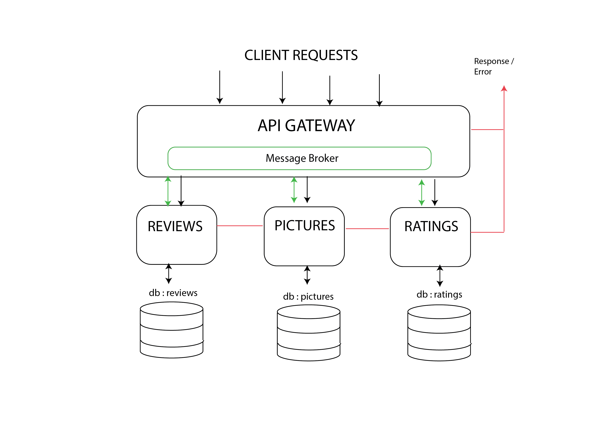

# Docker Compose

With docker compose we can launch the different micro-services. The structure for this app consists of one gateway connecting the other services.

However, only one service is complete so far, which is the pictures service.

After reading the tutorials [[1]] and [[2]], the `docker-compose.yml` file has the following structure. It deploys and runs a Dockerfile for each service built.

    services:
    gateway:
        image: image-repo/gateway
        build: 
            context: .
            dockerfile: gateway.Dockerfile
            cache_from:
            - gabcas28/ubuntu-node-mocha
        ports:
        - "5000:5000"
    pictures:
        image: image-repo/pictures
        build: 
            context: .
            dockerfile: pictures.Dockerfile
            cache_from:
            - gabcas28/ubuntu-node-mocha

This build starts the gateway and pictures containers, and exposes the port 5000 of the gateway service.

Once the command `docker-compose up` is executed, the app should be accessible through `localhost:5000`.

## Testing the docker-compose

Thanks to the automated tests brought by docker hub [[3]], all the files ended with `.test.yml` runs each time a we trigger a new build.

This feature is disabled by default and can be configured in the builds section of the docker hub.

The testing file `docker-compose.test.yml` deploys both the gateway and pictures app, and then the image for unit testing followed by another for integration testing. This is how it looks:

    version: '2' 
    services:
    sut:
        build: 
        context: .
        dockerfile: integration.Dockerfile
        volumes: 
        - ./src/:/app/src/
        - ./integration/:/app/integration/
        depends_on:
        - gateway
        - pictures
        - unit
    unit:
        build: 
        context: .
        dockerfile: Dockerfile
        volumes: 
        - ./src/:/app/src/
        - ./test/:/app/test/
    gateway:
        image: image-repo/gateway
        build: 
            context: .
            dockerfile: gateway.Dockerfile
        ports:
        - "5000:5000"
        depends_on: 
        - pictures
    pictures:
        image: image-repo/pictures
        build: 
            context: .
            dockerfile: pictures.Dockerfile

## References

[[1]] Docker. (2021). Docker COmpose. https://docs.docker.com/compose/
[[2]] Docker. (2021). Automated testing. https://docs.docker.com/docker-hub/builds/automated-testing/
[[3]] Chico de Guzman, P. (2016). How To Configure a Continuous Integration Testing Environment with Docker and Docker Compose on Ubuntu 14.04. https://www.digitalocean.com/community/tutorials/how-to-configure-a-continuous-integration-testing-environment-with-docker-and-docker-compose-on-ubuntu-14-04

[1]:https://docs.docker.com/compose/
[2]:https://docs.docker.com/docker-hub/builds/automated-testing/
[3]:https://www.digitalocean.com/community/tutorials/how-to-configure-a-continuous-integration-testing-environment-with-docker-and-docker-compose-on-ubuntu-14-04
