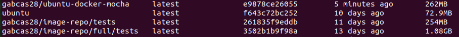

# Docker Hub

To understand more about Docker Hub repositories, these instructions might be useful [[1]][docker repos]. The repositories hold different images generated for our projects. In this case, the main goal is to create an image for testing purposes.

By linking the repository to a Github repository, we ask Docker Hub to collect these images and save them. This way we can access them and all the different versions we created.

To create Docker images, we use Dockerfile. These files contain instructions for building the container. For example, selecting the OS to use, which is the first command to add. Apart from an OS, the test container should have Node installed. It also should have all the program dependencies.

Yet, the size of the container should be the smallest possible. This way it is easier to download, build and run. It will use less of the computer resources when running and will be more shareable across environments. For these reasons, in this exercise we will generate and compare different containers.

The final goal is to make a container for testing. We could also want to assure that the tests are running in the same environment as our application [[2]][testing node]. That’s why we could create one image based on the application’s container.

But, since there is no code for production yet, we'll only do the container for tests.

## Docker Hub connection

First, link the GitHub profile with your Docker Hub account. These instructions follow all necessary steps for it’s connection: [[3]][automatic builds].

The Docker Hub linked to this project is: [gabcas28](https://hub.docker.com/repository/docker/gabcas28/).

## New repository with automated build

Then you can create a new repository, and link its automated builds to our Github repository. After we make a push into our project, DockerHub will create and save the container images from it.

This is the Docker Hub Repository linked to this project: [Image Repository](https://hub.docker.com/repository/docker/gabcas28/image-repository).

## Try different containers

The generated Dockerfile for the application is the following: [Dockerfile](../Dockerfile).

I tried node image first, and it turned out to be a bit heavy for this project. Then I switched to node:14-alpine. It includes node and npm and it's built on Alpine linux. I used 14 instead of current because it was giving an error. The size comparison of these images is notable and can be seen in the following caption.

As they define it in their website:

> Alpine Linux is a security-oriented, lightweight Linux distribution based on musl libc and busybox.

This distribution is specially useful for the Docker containers since makes them way smaller.

Finally, after further investigation, I tried the Ubuntu public image. It doesn't have Node nor NPM by default, so I decided to install them manually. I also added Mocha so it's not necessary to install it on every build.

The size comparison is even. It only adds a few MB:

As shown in this caption, the Ubuntu image itself it only weights 72.8 MB. Once Node is installed, along with NPM and Mocha, it surpasses the previous image only by 8 MB.

For this reason I pushed the image into Docker Hub, so it can be retrieved with the tag: `gabcas28/ubuntu-node-mocha`

## Running the image

When the image is ready, we run it adding the tests volume into the correct directory. This way we can modify the tests without rebuilding the entire image. The source code is inside the container at the moment:

    sudo docker run --rm -tv `pwd`:/usr/image-repository/tests/  gabcas28/ubuntu-node-mocha

## Optimize the container

Some commands like COPY, RUN, ADD, increase the layers of the containers. For this reason, it's a good practice to minimize them. Thee following Dockerfile, uses two COPY instructions when they could be reduced to one. The Run command is already optimized, as it runs everything in one single instruction, with multiple parts.

    FROM node:14-alpine

    WORKDIR /usr/image-repository/
    COPY package.json cc.yaml LICENSE ./
    COPY src ./src/

    ENV NODE_ENV dev

    RUN npm install .\
        npm install -g mocha

    CMD ["npm","test"]

To optimize the COPY instruction, we can make use of the `.dockerignore` file. We can tell the Dockerfile to everything in the actual folder, while using the `.dockerignore` to omit all the unnecessary files.

So instead of having:

    COPY package.json cc.yaml LICENSE ./
    COPY src ./src/

We reduce the layers to one by:

    COPY . ./

Using the `.dockerignore` as it follows:

    node_modules
    npm-debug.log
    tests
    doc
    package-lock.json
    README.md

The final stage is using the customized image. As it has Mocha already installed, this step is removed from the Dockerfile. This way the build time is reduced:

    FROM gabcas28/ubuntu-docker-mocha    <-- new image

    WORKDIR /usr/image-repository/
    COPY . ./

    ENV NODE_ENV dev

    RUN npm install .           <-- no mocha installation needed

    CMD ["npm","test"]

## References

[1] Docker. (2020). Repositories. https://docs.docker.com/docker-hub/repos/

[2] Una-Tsameret, N. (2016). Testing a Node.JS Application Within a Docker Container. https://dzone.com/articles/testing-nodejs-application-using-mocha-and-docker

[3] Docker. (2020). Configure automated builds from GitHub and BitBucket. https://docs.docker.com/docker-hub/builds/link-source/

[docker repos]:https://docs.docker.com/docker-hub/repos/
[testing node]:https://dzone.com/articles/testing-nodejs-application-using-mocha-and-docker
[automatic builds]:https://docs.docker.com/docker-hub/builds/link-source/