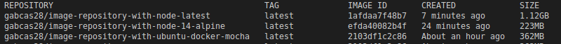

# Docker Containers

## Docker Hub connection

First, link the GitHub profile with your Docker Hub account. These instructions follow all necessary steps for it’s connection: [[3]][automatic builds].

The Docker Hub linked to this project is: [gabcas28](https://hub.docker.com/repository/docker/gabcas28/).

## New repository with automated build

This is the Docker Hub Repository linked to this project: [Image Repository](https://hub.docker.com/repository/docker/gabcas28/image-repository).

## Trying different containers

Three base images are compared, from heaviest to lightest:

1. node:latest
2. custom ubuntu image only with node and mocha pre-installed
3. node:14-alpine

As they define it in their website:

> Alpine Linux is a security-oriented, lightweight Linux distribution based on musl libc and busybox.

Even though the lightest image is node:alpine, I will use the ubuntu one. Because it's only 140MB bigger and a more familiar environment. Besides, it allows for automatic rebuilding when the base image is updated.

## About the custom base image

This custom image contains only node and mocha so it can be reused in other projects. It is not as secure as an Alpine distribution, yet it is also more flexible with file permissions.

The base image is built automatically from an [specific project found here](https://github.com/GabCas28/ubuntu-node-mocha).

## Running the image

When the image is ready, we run it adding the tests volume into the correct directory. This way we can modify the tests without rebuilding the entire image:

    sudo docker run --rm -tv `pwd`:/app/test/ gabcas28/image-repository

## Optimized container

The generated Dockerfile for the application is the following: [Dockerfile](../Dockerfile).

    FROM gabcas28/ubuntu-node-mocha

    WORKDIR /app
    COPY *.json assets ./

    ENV NODE_ENV dev

    RUN npm install .

    RUN useradd -ms /bin/bash tester
    USER tester

    CMD npm test

Some commands like COPY, RUN, ADD, increase the layers of the containers. For this reason, it's a good practice to minimize them. Thee following Dockerfile, uses two COPY instructions when they could be reduced to one. The Run command is already optimized, as it runs everything in one single instruction, with multiple parts.

Using the  [.dockerignore](../.dockerignore) as it follows:

    node_modules
    npm-debug.log
    tests
    doc
    package-lock.json
    README.md

## References

[1] Docker. (2020). Repositories. https://docs.docker.com/docker-hub/repos/

[2] Una-Tsameret, N. (2016). Testing a Node.JS Application Within a Docker Container. https://dzone.com/articles/testing-nodejs-application-using-mocha-and-docker

[3] Docker. (2020). Configure automated builds from GitHub and BitBucket. https://docs.docker.com/docker-hub/builds/link-source/

[docker repos]:https://docs.docker.com/docker-hub/repos/
[testing node]:https://dzone.com/articles/testing-nodejs-application-using-mocha-and-docker
[automatic builds]:https://docs.docker.com/docker-hub/builds/link-source/