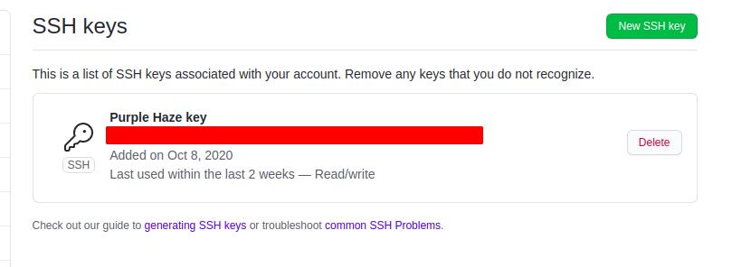
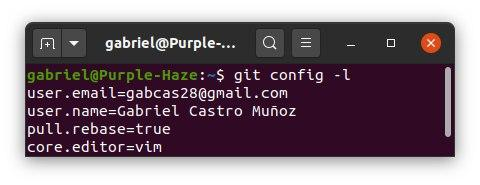

# Initial Set Up

This document describes the initial steps to get the project running along GitHub

## Key Pair

First of all, a new Key Pair is recommended to work with GitHub. If you don't have a public key, you can create a new one on your local machine, typing: 

`ssh keygen -t rsa`.  

Open the location of the key (normally ~/.ssh ) and look for the id_rsa.pub file. 

`cat ~/.ssh/id_rsa.pub`

Copy the public key and paste into **GitHub > Settings > SSH and GPG keys > New SSH Key**.

Following these steps, the GitHub will recognize the public id from your computer.

## Git Upstream and Rebase settings

Open a terminal and navigate to your repository.

`git remote add upstream https://github.com/ORIGINAL_OWNER/ORIGINAL_REPOSITORY.git` 

This command will set the original repository as upstream so the for can be updated from it.  

As explained in [1], you can change the default behavior for all of the current user's (existing and future) repositories via:

`git config --global pull.rebase true`  

You can check the global configuration typing `git config -l`.

 [1] [How to make git pull use rebase by default for all my repositories](https://stackoverflow.com/questions/13846300/how-to-make-git-pull-use-rebase-by-default-for-all-my-repositories)

