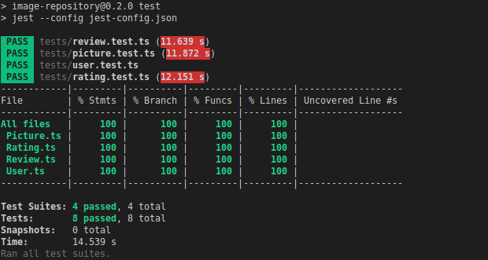
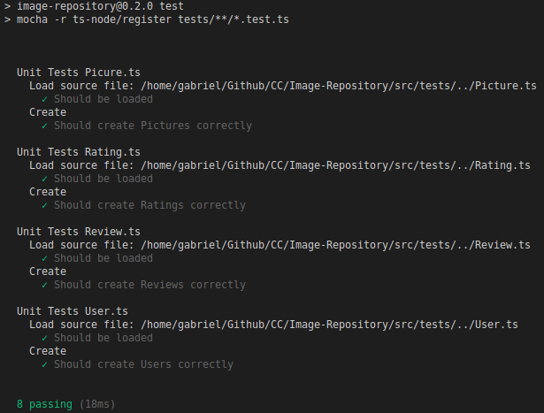

# Test Framework

Mocha or Jest are my preferred choices, and they both support typescript. After trying a few testing with Mocha, I found the errors messages are a bit verbose.

Looking at the Jest output, I see it is more descriptive. And after some research, especially [[2]](#references) and [[3]](#references), I saw its benefits. It provides parallel testing, which increases testing speed. Besides, Jest's output looks way more compact yet informative.

Still, I ran some passing tests with Jest and Mocha. Then, I decided to choose Mocha for the project because it proved to be faster.

## Test Framework comparison

### Jest

The output of the Jest tests shows that it took 14s to finish.

### Mocha

Mocha tests took 18ms instead

## References

[1] Bogan, M. (2020). Comparing the top 3 Javascript testing frameworks. Retrieved from https://dev.to/heroku/comparing-the-top-3-javascript-testing-frameworks-2cco

[2] Kithome, J. (2019). What’s the best unit testing frameworks for Node.js? Retrieved from https://blog.logrocket.com/the-best-unit-testing-frameworks-for-node-js/

[3] Marciniszyn, D. (2020). Jest test framework for TypeScript. Retrieved from https://codetain.com/blog/jest-test-framework-for-typescript